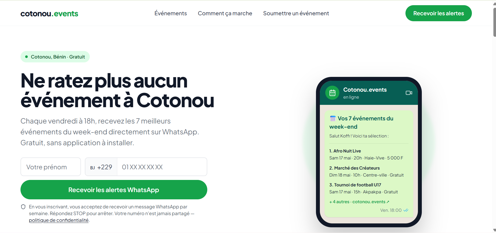
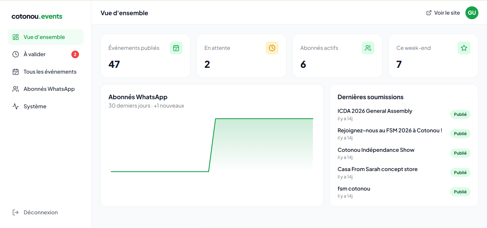

#Cotonou.events

Cotonou.events est une plateforme web qui centralise les événements organisés à Cotonou, au Bénin.

Les événements sont souvent dispersés entre Facebook, les groupes WhatsApp et les médias locaux. Cotonou.events les rassemble au même endroit afin de permettre aux utilisateurs de les découvrir plus facilement et de recevoir chaque vendredi une sélection personnalisée sur WhatsApp.

## Aperçu

<p align="center">
  
  
</p>

`Démo` : https://cotonouevents.tech

## Fonctionnalités

- Consultation des événements publiés
- Recherche par mot-clé
- Filtres par catégorie, date, prix et quartier
- Page détaillée pour chaque événement
- Soumission d’événements par les organisateurs
- Upload et stockage des affiches
- Inscription aux alertes WhatsApp
- Collecte automatique d’événements Facebook avec Apify
- Normalisation, filtrage et déduplication des données collectées
- Modération des événements
- Dashboard d’administration
- Envoi automatique d’un digest WhatsApp hebdomadaire
- Gestion des commandes WhatsApp `STOP` et `START`
- Monitoring des workflows d’automatisation
- SEO technique et données structurées

## Statut

La V1 est entièrement implémentée et testée.

Le site public, les formulaires, le dashboard d’administration, les workflows n8n, la collecte Apify et les automatisations WhatsApp sont opérationnels.

Le projet est prêt pour le déploiement en production.

## Architecture

```text
Next.js
├── Site public
├── Formulaires
├── Dashboard admin
└── Server Actions
        │
        ├── Supabase
        │   ├── PostgreSQL
        │   ├── Auth
        │   └── Storage
        │
        └── n8n
            ├── Apify
            ├── Meta WhatsApp Cloud API
            └── Monitoring
```

Next.js gère l’interface utilisateur, le rendu des pages et les mutations ponctuelles via les Server Actions.

Supabase fournit la base PostgreSQL, l’authentification du dashboard admin et le stockage des images.

n8n orchestre les traitements planifiés et événementiels : collecte des événements, traitement des soumissions, envoi des alertes WhatsApp et monitoring.

Aucun backend Node.js ou Express supplémentaire n’est utilisé.

## Stack technique

- Next.js 16 avec App Router
- TypeScript en mode strict
- Tailwind CSS
- Motion
- React Hook Form
- Zod
- Supabase
- n8n auto-hébergé sur Railway
- Apify
- Meta WhatsApp Business Cloud API
- Vercel

Les composants d’interface sont développés sur mesure, sans bibliothèque de composants externe.

## Prérequis

- Node.js 20.9 ou supérieur
- npm
- Un projet Supabase
- Une instance n8n
- Un compte Apify
- Une application Meta configurée pour WhatsApp Business Cloud API

## Installation

Clone le dépôt et installe les dépendances :

```bash
git clone <repository-url>
cd cotonou-events
npm install
```

Crée le fichier d’environnement local :

```bash
cp .env.example .env.local
```

Configure les variables suivantes :

```env
NEXT_PUBLIC_SUPABASE_URL=
NEXT_PUBLIC_SUPABASE_ANON_KEY=
SUPABASE_SERVICE_ROLE_KEY=
```

Démarre le serveur de développement :

```bash
npm run dev
```

L’application est accessible à l’adresse suivante :

```text
http://localhost:3000
```

## Base de données

Crée un projet Supabase, puis exécute les scripts SQL dans l’ordre :

```text
supabase/schema.sql
supabase/seed.sql
```

Le script `seed.sql` ajoute les données de démonstration et ne doit être exécuté qu’une seule fois.

La clé `SUPABASE_SERVICE_ROLE_KEY` doit rester exclusivement côté serveur. Elle ne doit jamais être exposée dans une variable préfixée par `NEXT_PUBLIC_`.

Les tokens Apify et Meta WhatsApp sont stockés dans les credentials n8n, et non dans l’environnement Next.js.

## Automatisations

Le projet utilise plusieurs workflows n8n indépendants :

- collecte des événements Facebook via Apify ;
- traitement des événements soumis depuis le site ;
- envoi du digest WhatsApp chaque vendredi ;
- gestion des commandes de désabonnement et de réabonnement ;
- centralisation du monitoring et des erreurs.

Supabase sert de source de données centrale entre le frontend et les workflows.

## Commandes

```bash
npm run dev
npm run build
npm run lint
npx tsc --noEmit
```

Avant tout déploiement, les commandes suivantes doivent réussir :

```bash
npm run build
npm run lint
npx tsc --noEmit
```

## Structure du projet

```text
src/
├── app/
│   ├── (public)/
│   ├── admin/
│   ├── llms.txt/
│   ├── icon.tsx
│   ├── opengraph-image.tsx
│   ├── robots.ts
│   └── sitemap.ts
├── components/
│   ├── admin/
│   ├── events/
│   ├── forms/
│   ├── layout/
│   ├── sections/
│   ├── ui/
│   └── whatsapp/
└── lib/
    ├── actions/
    ├── constants/
    ├── data/
    ├── seo/
    ├── supabase/
    ├── types/
    ├── utils/
    └── validations/

supabase/
├── schema.sql
└── seed.sql
```

## Sécurité

- Les écritures publiques passent par des Server Actions ou des webhooks n8n sécurisés.
- La clé Supabase `service_role` n’est jamais utilisée côté client.
- Les tables sensibles sont protégées par Row Level Security.
- Le dashboard admin est protégé par Supabase Auth.
- Les secrets Apify et WhatsApp restent dans les credentials n8n.
- Les formulaires sont validés côté client et côté serveur.

## Déploiement

Le frontend est prévu pour être déployé sur Vercel.

Avant le déploiement :

1. configure les variables d’environnement dans Vercel ;
2. applique le schéma Supabase de production ;
3. configure les credentials de production dans n8n ;
4. active les URLs de production des webhooks ;
5. configure le webhook Meta WhatsApp ;
6. vérifie la timezone `Africa/Porto-Novo` dans n8n ;
7. exécute les vérifications de build, de lint et de typage.

Le domaine prévu pour la production est :

```text
cotonouevents.tech
```

## Périmètre de la V1

La première version ne comprend pas :

- de comptes utilisateurs publics ;
- d’application mobile native ;
- de billetterie ou de paiement en ligne ;
- de commentaires ou d’avis ;
- de notifications push ;
- de recommandations par intelligence artificielle ;
- de scraping Instagram ;
- de gestion avancée de plusieurs administrateurs.
